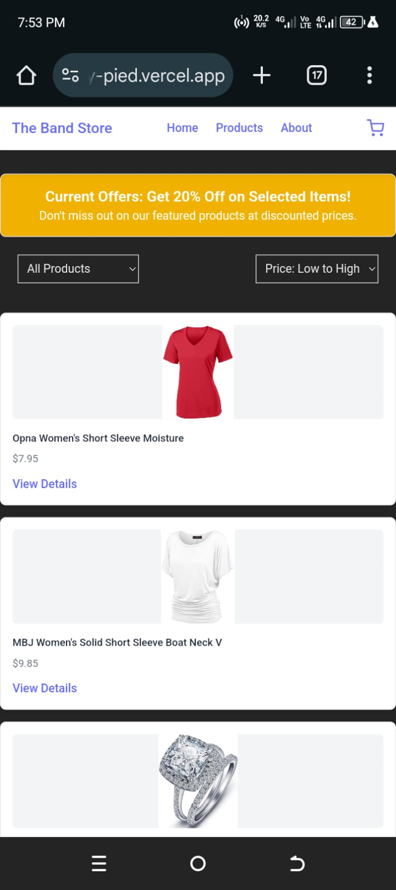
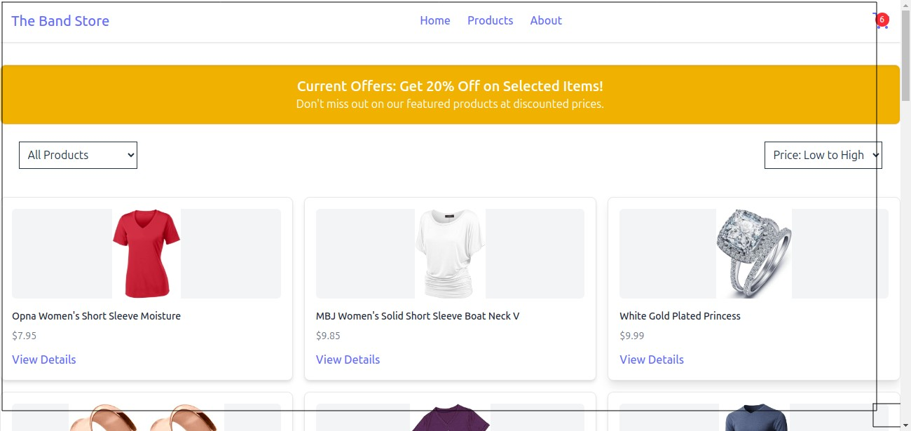

# ReactJS Product Management Dashboard
This is a simple **ReactJS** web application built with **TypeScript**. The project showcases a list of products for sale and an admin dashboard with analytics and CRUD operations for product management. It also includes user authentication and a responsive UI.

## Table of contents

- [Project Overview](#project-overview)
  - [Core Features](#core-features)
  - [Screenshot](#screenshot)
  - [Links](#links)
- [Tech Stack](#tech-stack)
- [Built With](#built-with)
- [Project Structure](#project-structure)
- [Getting Started](#getting-started)
- [Tech Stack](#tech-stack)
- [Admin Authentication](#admin-authentication)
  - [Protected Routes](#protected-routes)
- [Admin Dashboard](#admin-dashboard)
- [API Integration](#api-integration)
- [Author](#author)

## Project Overview 

### Core Features: 
- Product Listing: A list of products and their details.
- Product Management: Add, edit, delete, and update product details.  
- Admin Dashboard: Visualize sales and inventory data through charts.  
- Authentication: Secure login with protected admin routes.  
- Responsive Design: Built with **Tailwind CSS** for mobile and desktop views.  
- Global State Management: Using React Context API.

### Screenshot



### Links
- Solution URL: [Github Repository](https://github.com/ggkm3251/investment_project)
- Live Site URL: [Vercel Hosted Website](https://product-bay-pied.vercel.app/) 

## Tech Stack  

- ReactJS with TypeScript
- Tailwind CSS for styling  
- React Context API for global state management  
- React Router for routing  
- Chart.js for data visualization  
- Mock API for fetching product data (using JSON Placeholder and Faker API)  

## Built With
Initialized with ViteJS (React as the template for the project, and opted for Typescript).
```
npm create vite@latest
```

## Project Structure
```
product-bay/
├── node_modules/          # Installed packages
├── public/                # Static files
│   └── vite.svg           # Vite logo
├── src/                   # Main source code
│   ├── assets/            # Static assets (images, fonts, etc.)
│   ├── components/        # Reusable components
│   │   ├── AuthContext.tsx      # Context for managing user authentication
│   │   ├── Card.tsx             # Reusable Card component for UI consistency
│   │   ├── CartContext.tsx      # Context for managing cart state
│   │   ├── Footer.tsx           # Footer component
│   │   ├── Login.tsx            # Login component
│   │   ├── NavBar.tsx           # Navigation bar
│   │   ├── PrivateRoute.tsx     # Higher-order component for protected routes
│   │   ├── ProductCard.tsx      # Product card component for the product list
│   │   ├── ProductManagement.tsx # Admin product management component
│   │   ├── PromotionalBanner.tsx # Promotional banner for homepage
│   │   ├── Sidebar.tsx          # Admin dashboard sidebar
│   │   └── Testimonials.tsx     # Testimonials section component
│   ├── pages/             # Pages for routing
│   │   ├── AdminDashboard.tsx  # Admin dashboard page
│   │   ├── CartPage.tsx        # Shopping cart page
│   │   ├── Home.tsx            # Home page displaying products
│   │   └── ProductDetails.tsx  # Product details page
│   ├── screenshots/       # Screenshots for README documentation
│   ├── App.css            # Global styles
│   ├── App.tsx            # Main App component
│   ├── index.css          # Tailwind CSS configuration
│   ├── main.tsx           # Application entry point
│   └── vite-env.d.ts      # Vite environment types
├── .gitignore             # Files to ignore in Git
├── eslint.config.js       # ESLint configuration
├── index.html             # Main HTML file
├── package-lock.json      # Dependency lock file
├── package.json           # Project metadata and dependencies
├── tsconfig.app.json      # TypeScript configuration for the app
├── tsconfig.json          # Base TypeScript configuration
├── tsconfig.node.json     # TypeScript configuration for Node.js
└── vite.config.ts         # Vite configuration file

```
  
## Getting Started

Step 1: Clone the repository
```
git clone git@github.com:ggkm3251/product-bay.git
cd product-bay
```
Step 2: Install dependencies
```
npm install
```
Step 3: Run the development server [Tech Stack](#tech-stack)
```
npm run dev
```
The app will be available at http://localhost:5173

## Admin Authentication
Email: 
```
admin@example.com
```
Password: 
```
password
```

### Protected Routes
The admin dashboard and product management routes are protected. Unauthorized users will be redirected to the login page.

## Admin Dashboard

- Analytics:
-- Sales Performance Chart (Line chart)
-- Inventory Status (Pie chart)
-- Product Comparison (Bar Chart)
-- Inventory Levels (Horizontal Bar Chart)
- Product Management:
-- Add, edit, delete, and update product details
-- Product list with id, name, price, and action

## API Integration
Mock API: The app uses JSON Placeholder or Faker API to simulate real-world data fetching.
Replace with Real API: You can easily replace the mock API with a real backend API for production use. Just update the API endpoints in the services or fetch functions

## Author
This project is designed, developed and maintained by: [Glenn Mwangi](https://github.com/ggkm3251)

For any inquiries, please reach out:
Email: [glennkamau2@gmail.com](glennkamau2@gmail.com)